## TL;DR

**“Can I build an Agent system with Dify?”**

Bottom line: Dify is a **powerful no-code platform purpose-built for LLM application development**. It delivers outstanding productivity for RAG pipeline setup, rapid prototyping, and integrating multiple model providers.

That said, in environments that require enterprise-grade operational automation, fine-grained governance, and large-scale traffic handling, there are structural limitations. The right way to think about Dify is **not as a replacement for AgentOps, but as an accelerator that increases experimentation and validation speed before AgentOps**.

---

## Background: Why Dify Matters

As agent-based systems spread quickly, I keep hearing the same question in the field:

> “If the Agent setup is about this complex, do we really need to build a complicated platform? Isn’t a no-code tool like Dify enough?”

Based on my hands-on experience using Dify, this post summarizes **where no-code LLM platforms shine—and where they hit real limits**.

---

## Two Approaches to Building Agent Platforms

Today, Agent systems typically fall into two broad approaches.

**Code-first architectures** (Python/TypeScript) provide explicit state management, testing, deployment, and observability. They offer maximum flexibility and tend to be better for operational stability.

**No-code / low-code workflows** are built through a visual UI. They excel at fast experimentation and low barriers to entry—even non-developers can participate.

Dify is one of the most notable options in the latter category: **a leading open-source platform specialized for LLM applications**.

---

## What Is Dify?

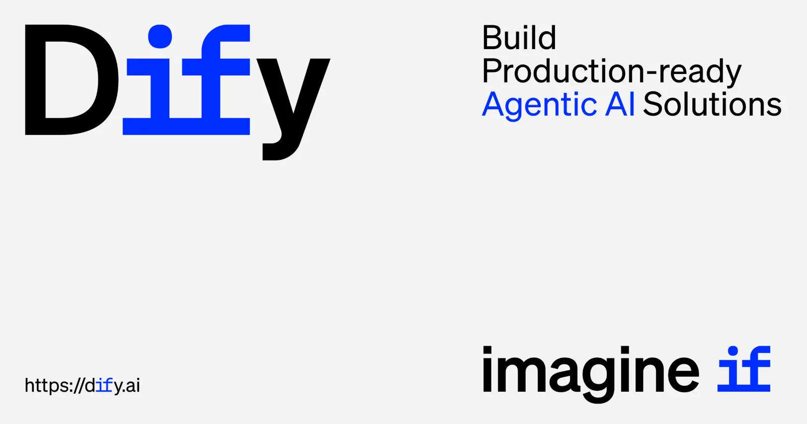

[Dify](https://dify.ai/) is an open-source AI application platform operated by LangGenius. It focuses on building Agents, RAG, and Workflows.

Unlike general-purpose automation tools like n8n or Make, Dify is **specialized for LLMOps**. It bundles prompt management, model routing, dataset management, evaluation loops, and more—core capabilities for building LLM apps—into a single platform.

### Pricing and Delivery Options

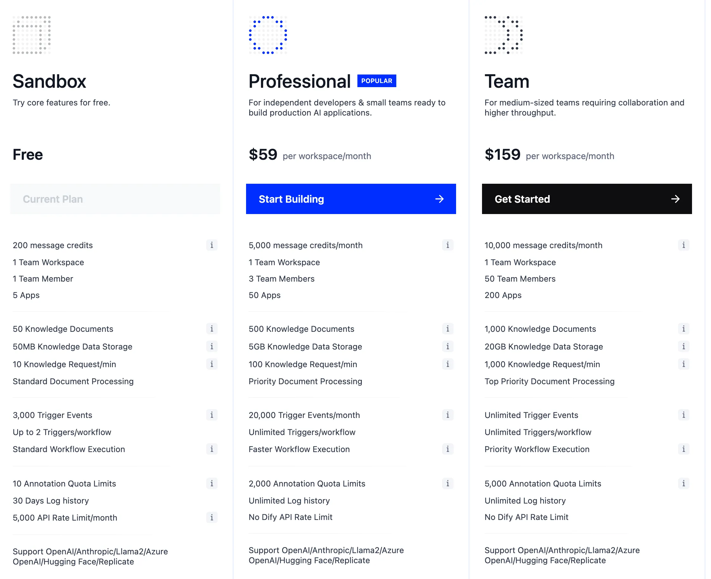

Dify offers two deployment models: **Cloud (Managed)** and **Self-hosted (OSS)**.

The Cloud version includes Sandbox (free), Professional ($59/month), and Team ($159/month). The self-hosted option is free as open source, and it’s a strong fit for companies that care about **data sovereignty and compliance**. However, there are some constraints for team-scale operations, such as multi-user limitations.

---

## Dify’s Core Strengths

### 1. An LLMOps-Specific Platform

Dify isn’t a general automation tool—it’s **built specifically for LLM app development**. It supports the full LLM app lifecycle: prompt versioning, model routing, evaluation, dataset management, and more. Many of these features require custom implementation in n8n or Make, but are built-in here.

### 2. A Model-Agnostic Architecture

It supports OpenAI and Anthropic, as well as open-source models like Llama and Mistral, plus local models via Ollama. Model switching and routing are easy, which helps with cost optimization and performance benchmarking.

### 3. Built-In RAG Pipelines

Without external tools, you can build an **end-to-end RAG pipeline**—data ingestion, chunking, embeddings, retrieval, and re-ranking. This is one of Dify’s strongest differentiators.

### 4. Open Source + Self-Hosting

Because you can self-host, Dify is a good fit for enterprise environments that require **data sovereignty, security compliance, and customization**. On-prem deployments can keep sensitive data from being exposed externally.

### 5. Multiple Deployment Options

After building a workflow, you can ship immediately as an API, web app, chatbot widget, iframe embed, and more. The transition from prototype to MVP is very fast.

---

## When Dify Is a Great Fit

Dify is especially effective in scenarios like these:

For **RAG-based chatbots/copilots**, Dify’s built-in Knowledge features stand out. You can validate quickly without standing up a separate vector DB.

It’s also well-suited for **internal knowledge assistants**. With self-hosting, you can keep data inside your network while building a Q&A system on top of internal documents.

When you need **LLM model comparison experiments**, switching models is simple, making it easy to compare performance and cost across providers.

It also works well as an **AI experimentation environment for non-developers**. PMs, planners, and domain experts can build prototypes directly.

---

## Workflow Feature Breakdown

Dify workflows behave similarly to established automation tools like n8n and Make.

When creating an app, you can choose Workflow, Chatflow, Chatbot, Agent, or Text Generator.

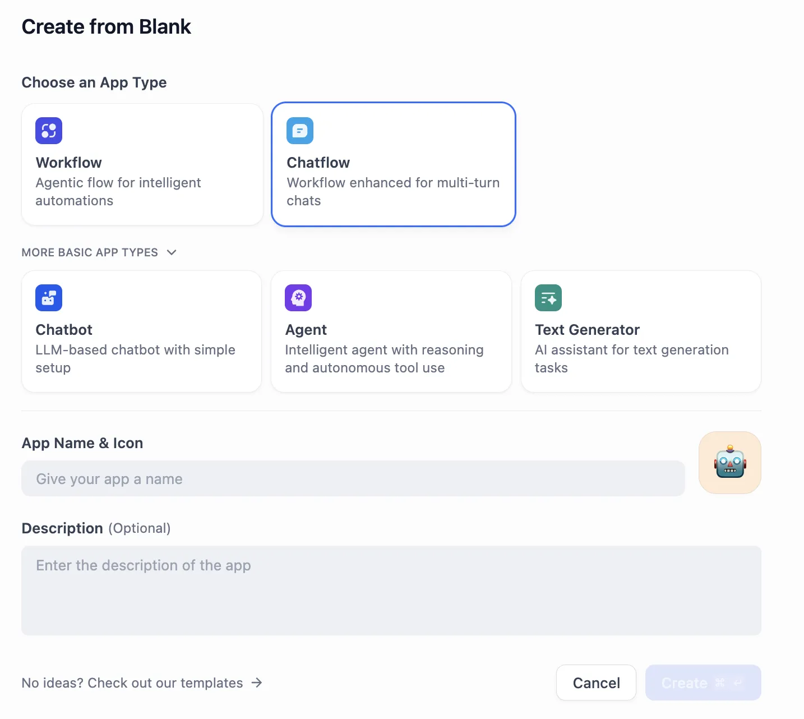

The workflow editor provides an intuitive node-based UI.

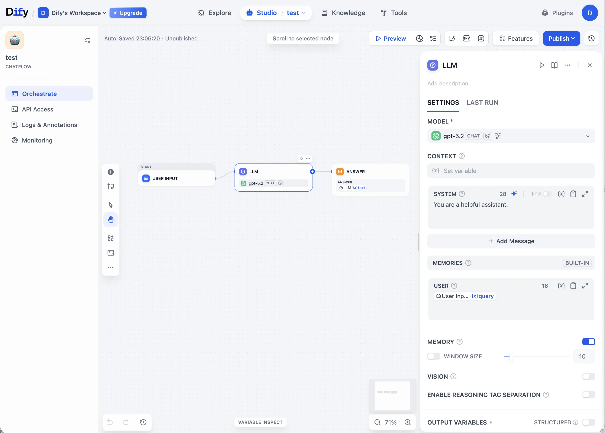

Thanks to the intuitive UI, you can run fast experiments at the PoC stage. The Preview feature enables immediate validation, and you also get multiple deployment options like API, Chatbot, and Embed.

<video autoplay loop muted playsinline style="max-width:100%">
  <source src="/img/dify/act1.mp4" type="video/mp4">
</video>
With a single Preview click, you can see results instantly. You can build a fast feedback loop without writing code, which is particularly useful during PoC.

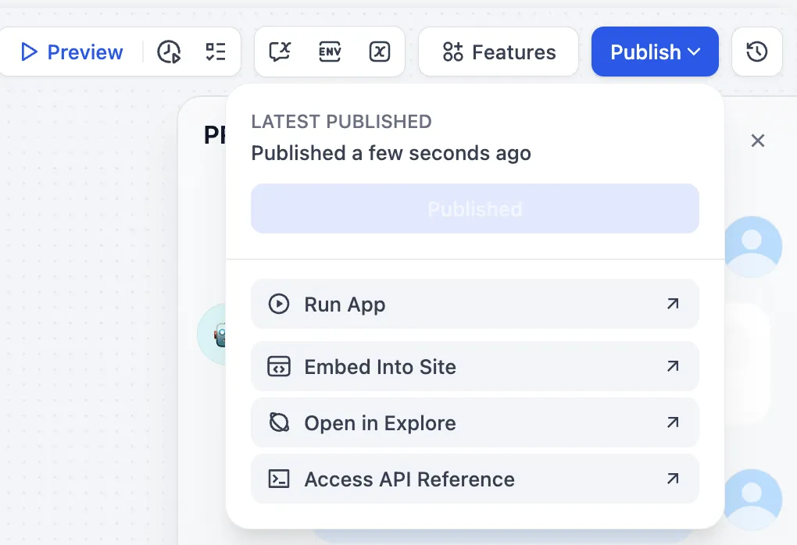

Once the workflow is complete, you can deploy immediately via Run App, Embed Into Site, or API Reference.

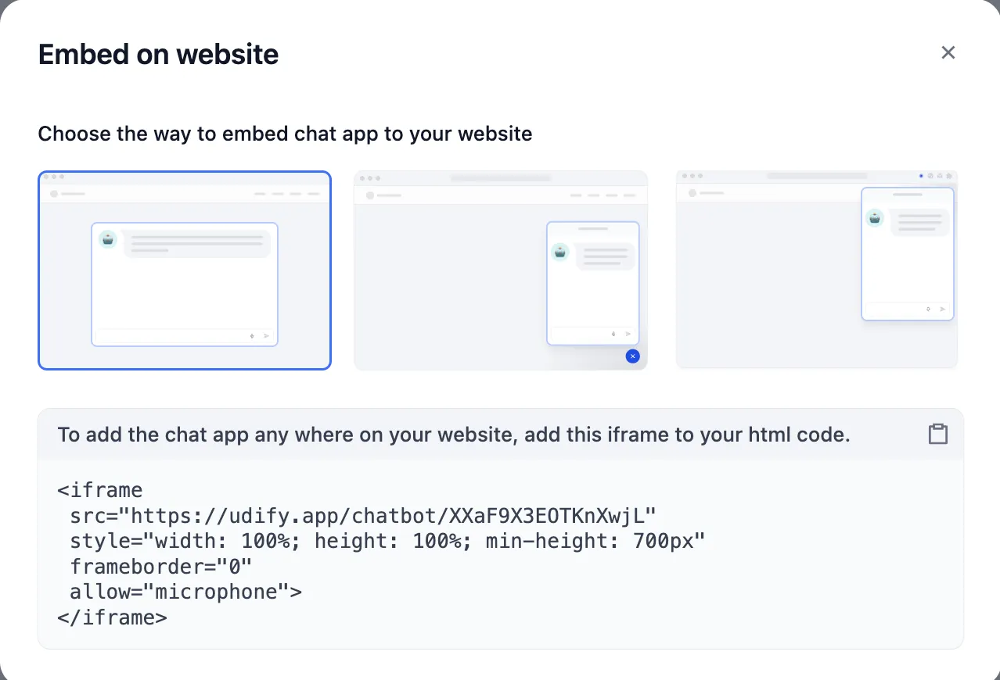

You can easily integrate into a website via iframe embed or a chatbot widget. The speed from prototype to a real service is a clear strength of Dify.

### Workflow Limitations

As conditional branching and state become more complex, readability drops and maintenance costs rise. Ultimately, there’s an inherent limitation: it’s effectively expressing if/else logic through a UI.

> Past a certain level of complexity, you end up concluding, “It’s better to write this in code.”

---

## RAG Pipelines: Dify’s Strongest Area

The most impressive part of Dify is its **Knowledge (RAG) pipeline**.

When you upload PDFs or PPTs, it can run LLM-based OCR. Chunk settings are flexible, and you can preview results via Chunk Preview. It supports Top-k and cosine-similarity-based retrieval. The big advantage is being able to **validate end-to-end RAG quickly** without building an external vector DB or a separate pipeline.

### Chunk Settings

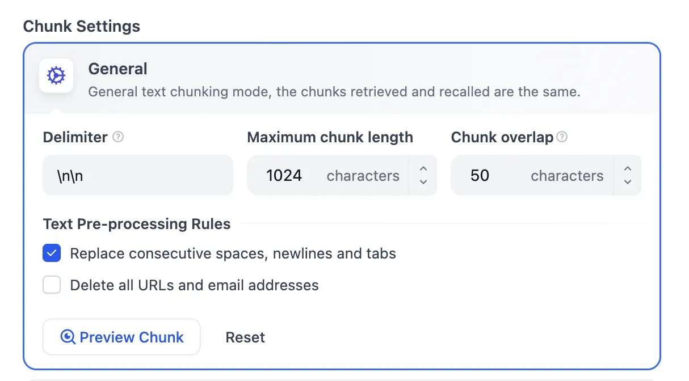

You can fine-tune Delimiter, Maximum chunk length, Chunk overlap, and more. You can also customize text preprocessing rules.

### Chunk Preview

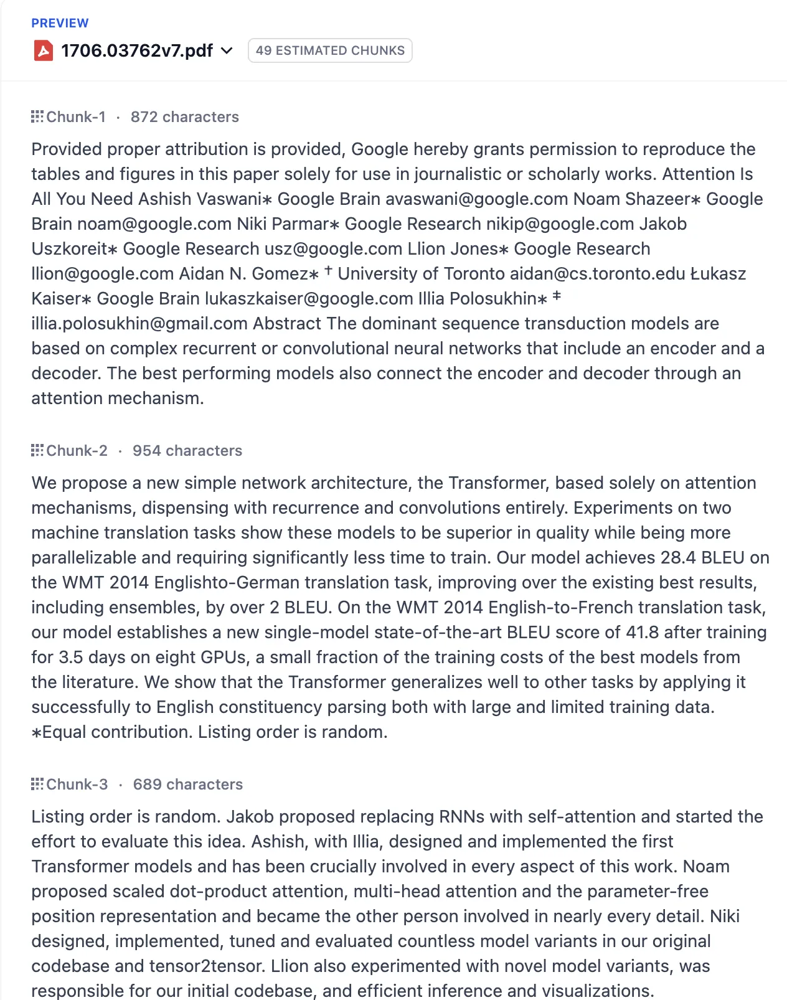

After uploading a document, you can preview the actual chunking output. This is essential for RAG quality tuning.

This part feels especially compelling. You can inspect the content and set appropriate values accordingly.

### Retrieval Settings

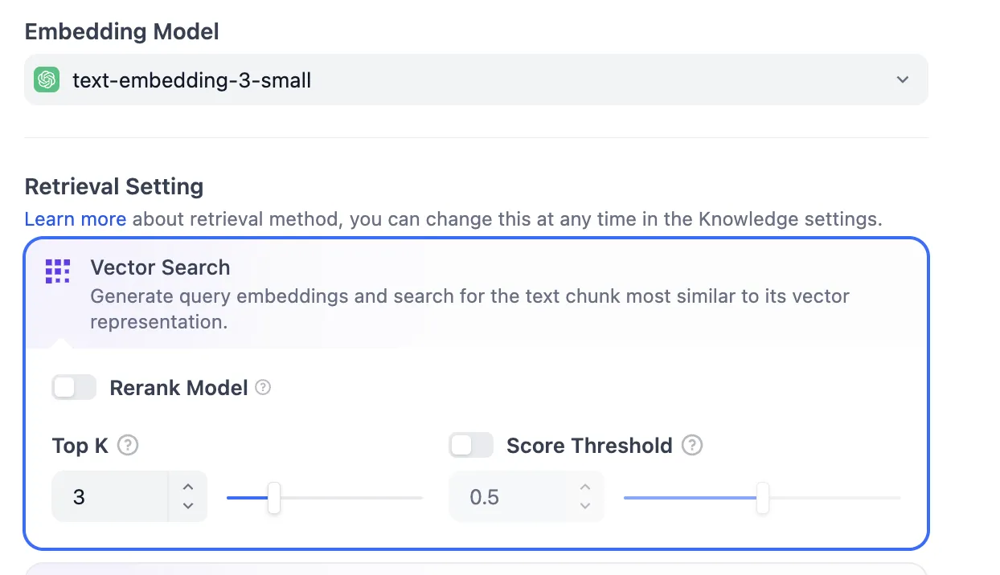

You can intuitively tune retrieval parameters such as Embedding Model selection, Vector Search options, Rerank Model, Top K, and Score Threshold. This feels similar to implementing it in code.

### Structural Constraints of RAG

However, the Knowledge (Vector Store) created in Dify is **tightly bound to Dify itself**. You can’t access it directly from external services; it can only be used through Dify workflows.

That means **reusability is low unless you build the entire system around Dify**. If you need integration with existing systems, you should factor this in.

---

## Plugin Ecosystem and MCP Support

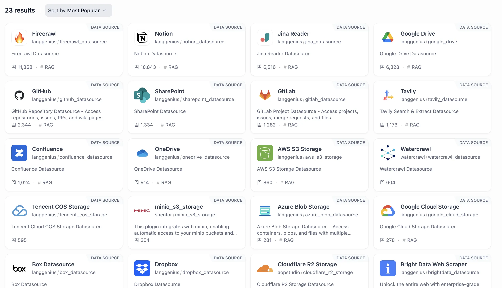

Dify provides a range of data source plugins, supporting integrations with services like Firecrawl, Notion, GitHub, Google Drive, SharePoint, and Confluence.

That said, since Dify is newer, the marketplace is still limited compared to n8n’s 500+ nodes. In many cases, you’ll likely need to implement the required MCP (Model Context Protocol) Server yourself. The ecosystem is growing quickly, but as of now, it’s less mature than n8n.

---

## Operational Considerations

### Observability Features

Dify includes basic monitoring capabilities.

In **Logs**, you can inspect request/response-focused logs.

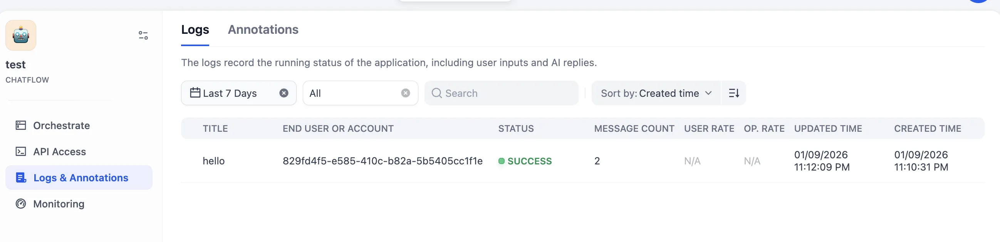

In the **Monitoring Dashboard**, it provides baseline metrics such as Total Conversations, Active Users, Token Usage, and Token Output Speed.

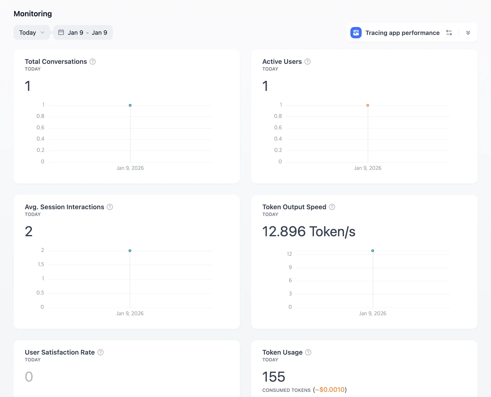

It also supports **Tracing integrations**, including Langfuse, LangSmith, and Opik.

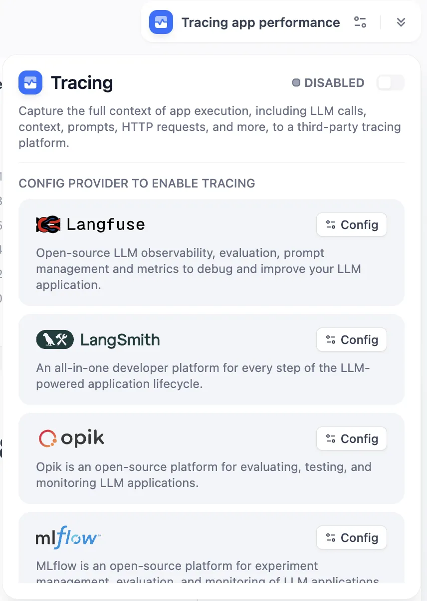

For PoCs or small-scale operations, this is generally sufficient.

### Limits for Enterprise Operations

In large enterprise environments, there are some constraints.

From a **governance** standpoint, if you need policy controls like token budget policies, failure handling and rollback, SLO/SLA-based automation, or sophisticated RBAC, it may not be a great fit.

From an **observability** standpoint, support is currently lacking for granular metric aggregation at the Agent/Tool level and policy automation based on cost/latency/success rate.

From a **scalability** standpoint, stability under high concurrency, load balancing, and traffic protection need to be designed and implemented by you in a self-hosted environment.

> It’s sufficient for PoC and small-scale operations, but large-scale production environments require additional infrastructure design.

---

## Differences vs. n8n and Make

A direct apples-to-apples comparison between Dify and n8n/Make isn’t quite right—they aim at different goals.

**n8n/Make** are general-purpose automation platforms, strong at connecting many SaaS apps and automating workflows. They have 500+ nodes and a rich ecosystem.

**Dify** is specialized for LLM app development, providing native support for RAG, Agents, prompt management, and model routing.

If you need general automation, n8n/Make are better choices. If your goal is **building LLM-based AI products**, Dify is often more efficient.

---

## Conclusion: The Right Positioning for Dify

Dify is a **powerful no-code platform for LLM application development**.

Its strengths are clear: high productivity for RAG pipelines, rapid prototyping, multi-model integration, and self-hosting. It’s excellent from idea validation through MVP development.

Its limitations are also clear. Enterprise-grade governance, fine-grained observability, and large-scale traffic handling require additional design and implementation.

It’s best to understand Dify **not as an AgentOps replacement, but as an accelerator**. A practical strategy is to move faster during PoC and experimentation, then extend into a code-first architecture as needed when transitioning to production.

---

## Key Takeaway

> **Dify is a powerful tool for building LLM apps quickly—but large-scale operations require additional design.**