## Summary

In the no-code/low-code workflow automation market, n8n and Make have effectively become the standard.  
In that landscape, an open-source project called sim has emerged, positioning itself around LLM-generated workflows created from natural language prompts.

[sim](https://www.sim.ai/) officially supports Self-hosted deployments as well as Cloud-hosted (Managed), and even provides both Helm Charts and docker-compose.  
However, its core feature—Copilot (LLM-based workflow generation)—has a structural limitation: even in Self-hosted environments, it requires a paid API Key.

---

## TL;DR

- sim is an open-source no-code agent tool that generates workflows from natural language input.  
- It supports both Cloud-hosted and Self-hosted deployments, with relatively strong operational convenience.  
- It provides RAG (Knowledge), MCP, and a wide range of app integrations.  
- Its core feature, Copilot, requires paid billing even in Self-hosted environments.  
- Without Copilot, much of sim’s advantage disappears.

---

<video autoplay loop muted playsinline style="max-width:100%">
  <source src="/img/sim/action1.mp4" type="video/mp4">
</video>

## What is sim?

These days, the no-code agent builder market is dominated by n8n and Make.  
sim is an open-source project in that market that puts natural-language-based automatic workflow generation front and center.

When a user enters requirements in natural language, the LLM interprets them and builds a workflow.  
This approach also reminds me of Google’s Opal, which is still in beta.

sim is available as open source, and it also offers a Managed Cloud-hosted service.

---

## Pricing Model and How LLMs Are Used

On Cloud-hosted, the free plan includes $20 in credits.

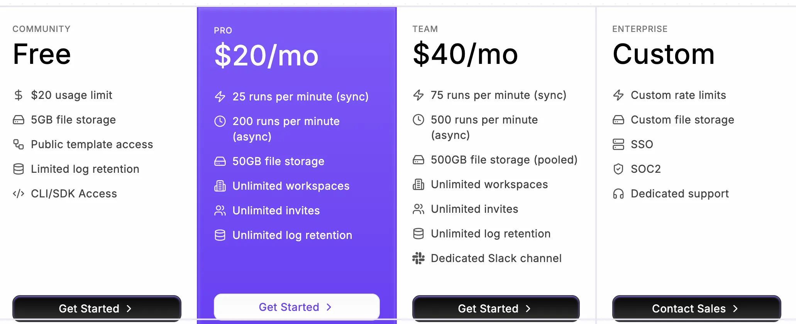

The LLM used within workflows can be configured in two ways. (Copilot provided by sim does not fall into this category.)

- Use your own LLM API Key (openai, claude, etc.)
- Use a platform key provided by sim

If you use the platform key instead of your own API Key, the cost increases by about 2x. Judging by the warning message shown when you delete a personal API Key, it feels like even sim recommends using your own LLM API Key for workflows.

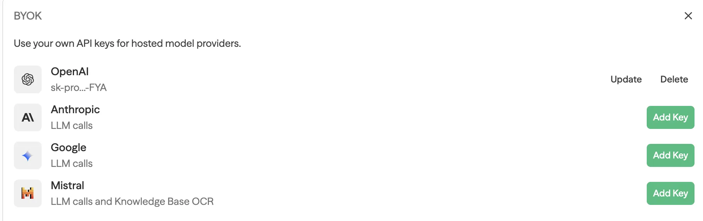
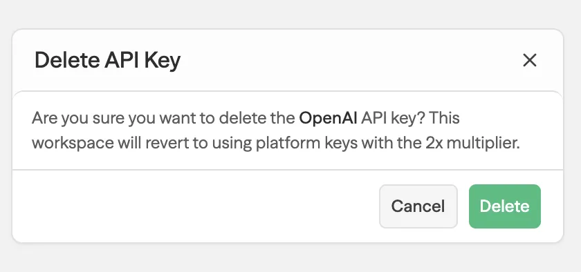

---

## Self-hosted Support Is a Clear Advantage

sim officially supports Self-hosted environments in addition to Cloud-hosted.

Because it provides both docker-compose and Helm Charts,  
it’s relatively straightforward to operate even in Kubernetes environments.

From an operations perspective, this is a major advantage for sim. However, as I’ll explain later, there’s a limitation: because of the Copilot API Key requirement, costs and constraints still exist even in Self-hosted deployments.

## How It Works (Basic Flow)

sim’s basic flow works like this:

1. Configure the LLM model you want to use.  
2. Enter the task you want in natural language.  
3. The LLM interprets it and automatically generates a workflow.

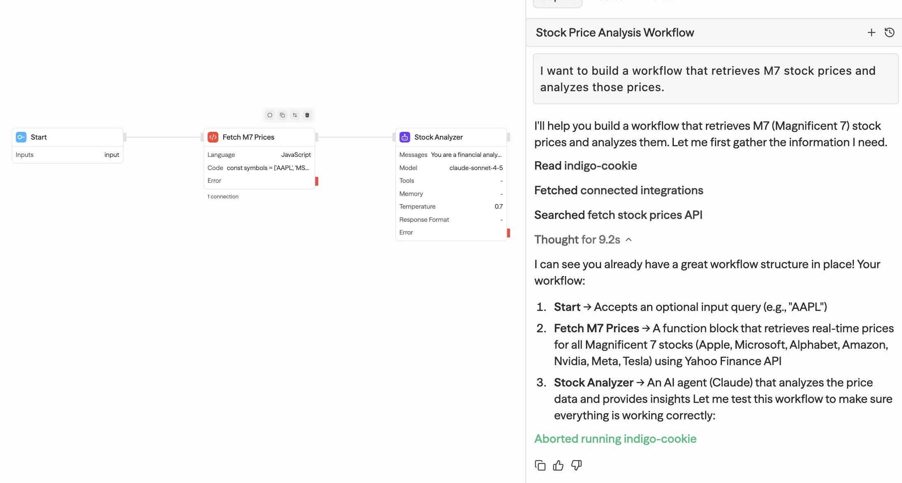

The generated workflow isn’t just simple node connections—  
it can also include Code execution steps as needed.

You can run it immediately using the RUN button at the top of the UI.

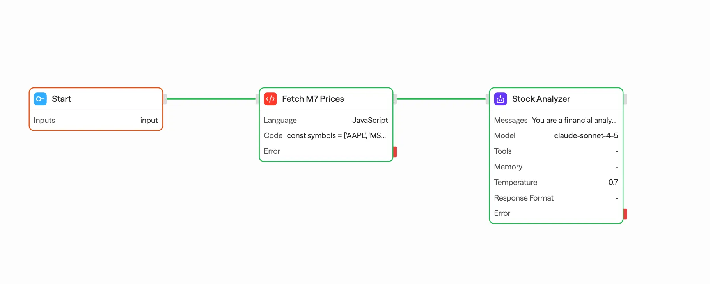
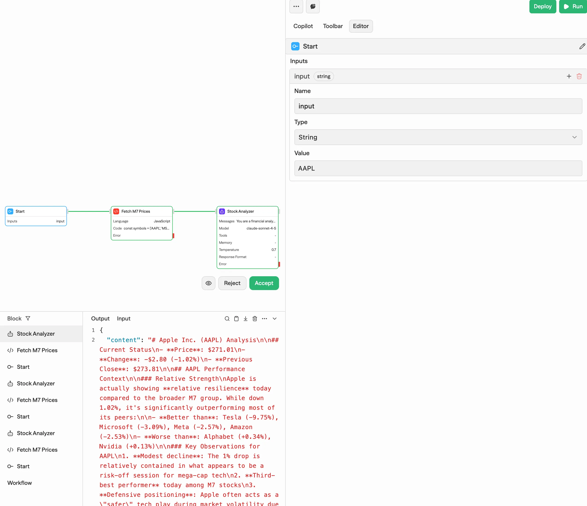

---

It’s surprising that you can build a workflow—including an Agent—this easily.

## Deploy and Trigger

Workflows can be deployed, and deployed workflows can be executed via API calls.

Supported triggers include:

- Start (API or manual execution)
- Schedule
- Webhook
- RSS Feed

Multiple triggers can be configured, and execution priority is summarized in [Official Docs - Trigger](https://docs.sim.ai/triggers).

---

## Toolbar and Integration

sim supports not only LLM-based auto-generation, but also manual configuration.

The Toolbar provides a large number of Tools and Integrations,  
and it’s already connected to many external services. It looks like it includes pretty much anything you’d want to build.

---

## Logging System

The execution logging system is also well built. It tracks run success/failure, trigger type, and even detailed error messages—overall, the logging is quite solid.

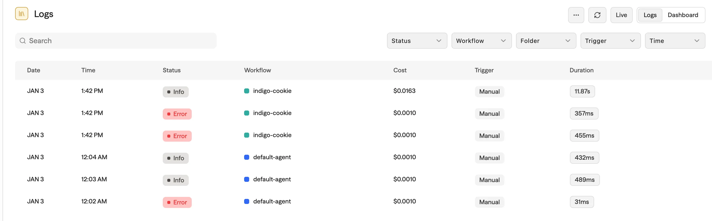
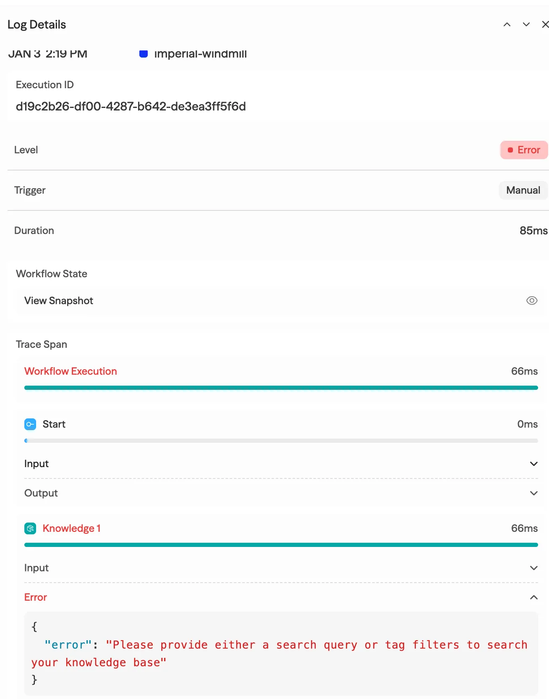

It’s at a level that’s fully usable in production operations.

---

## Template

You can import pre-built workflows in the form of Templates.

This is practical because you don’t have to generate everything via LLM from scratch.

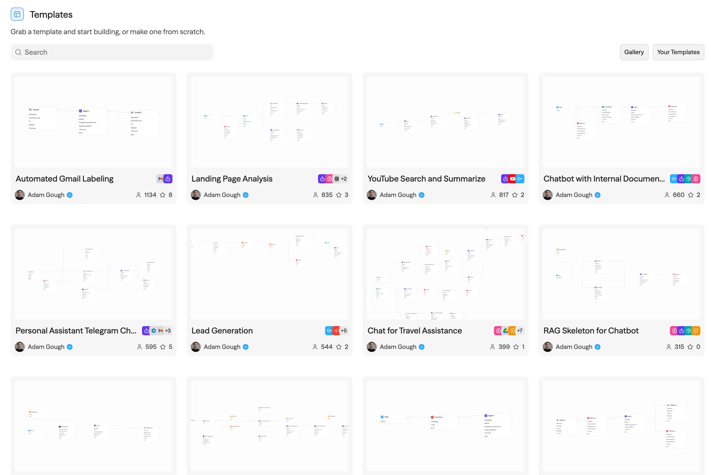

---

## Knowledge: RAG Setup

sim supports Vector Store-based RAG via its Knowledge feature.

I tested it by uploading the Transformer paper, and chunking and vectorization completed quickly.

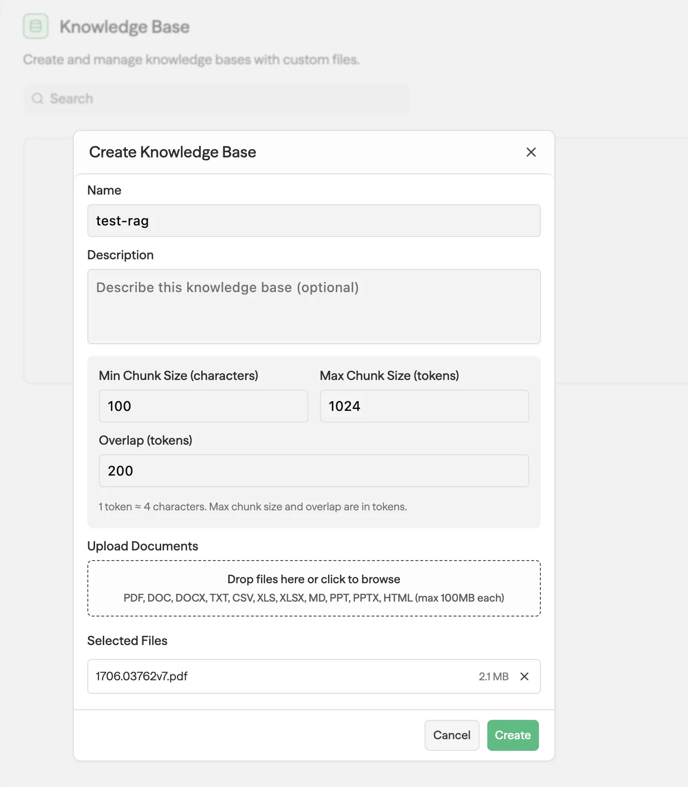
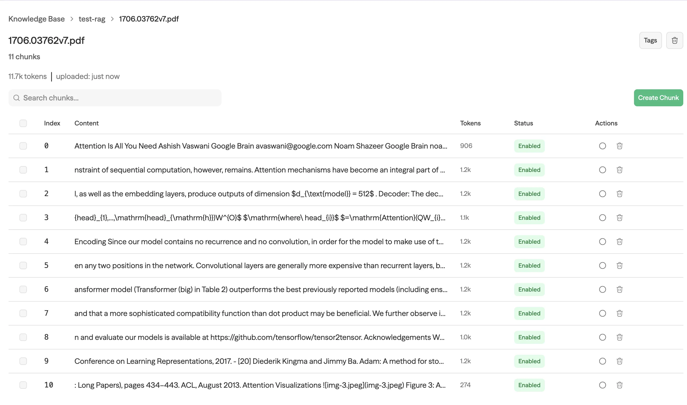

It also supports OCR, so it can process image-based documents as well. The fact that you can set up a RAG system this easily is compelling. I didn’t measure performance, so I’m not sure. Depending on the documents, I suspect you’d need to tune it yourself.

---

## Fix in Copilot

The debugging experience is pretty impressive.

Even when it’s hard to find what needs to be fixed—a common issue with no-code tools—the Fix in Copilot feature resolves problems automatically. You click a button, and the LLM debugs and repairs the workflow on its own. I find this part especially compelling.

<video autoplay loop muted playsinline style="max-width:100%">
  <source src="/img/sim/action2.mp4" type="video/mp4">
</video>

---

## MCP Support

Basic MCPs are already registered,  
and if needed, you can add MCPs yourself.

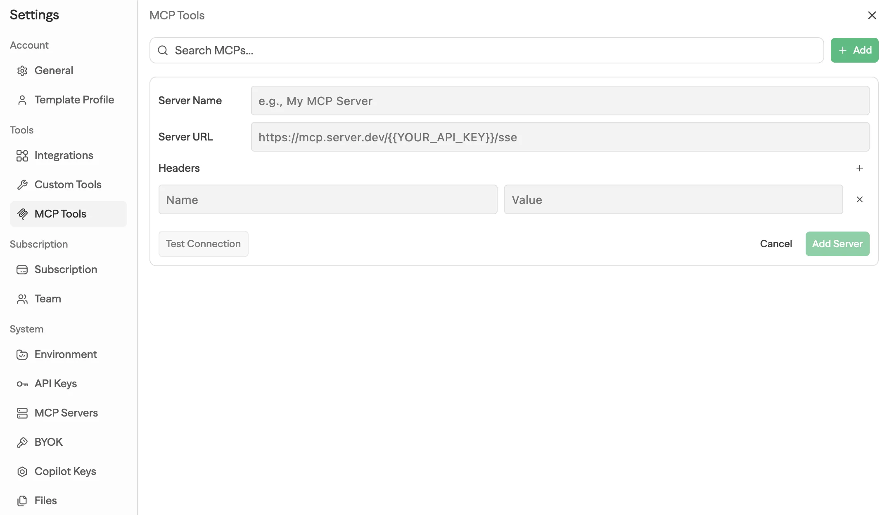

---

## Drawback: Copilot API Key Dependency

Unfortunately, I also want to mention a critical drawback. This won’t matter to people using Cloud-hosted.

But in Self-hosted environments, the biggest drawback isn’t Copilot itself—it’s the structure that *requires* a Copilot API Key.

To use sim’s Copilot, even in Self-hosted deployments, you must use an API Key issued by sim.

For someone like me who wants to build an Agentic AI system using Self-hosted open source plus my own LLM API Key, I don’t like the fact that another SaaS tool gets inserted.  
This structure becomes a clear constraint for engineers who care about controlling LLM costs and maintaining data sovereignty in Self-hosted environments.

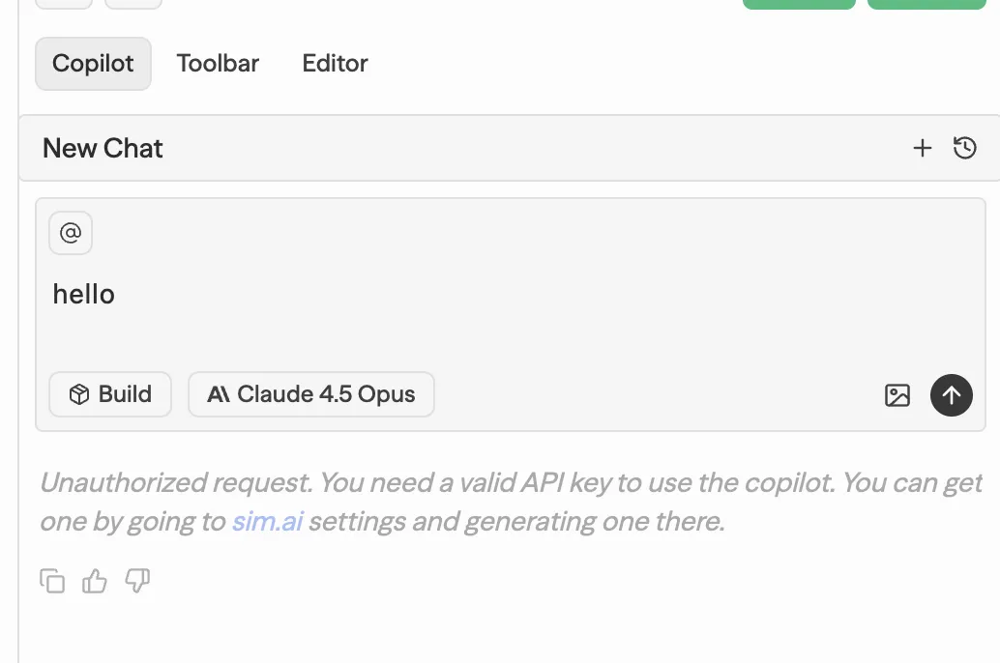
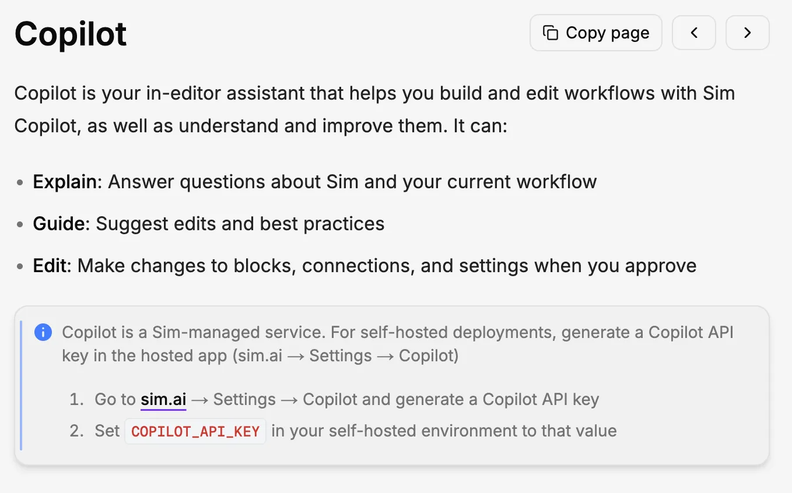
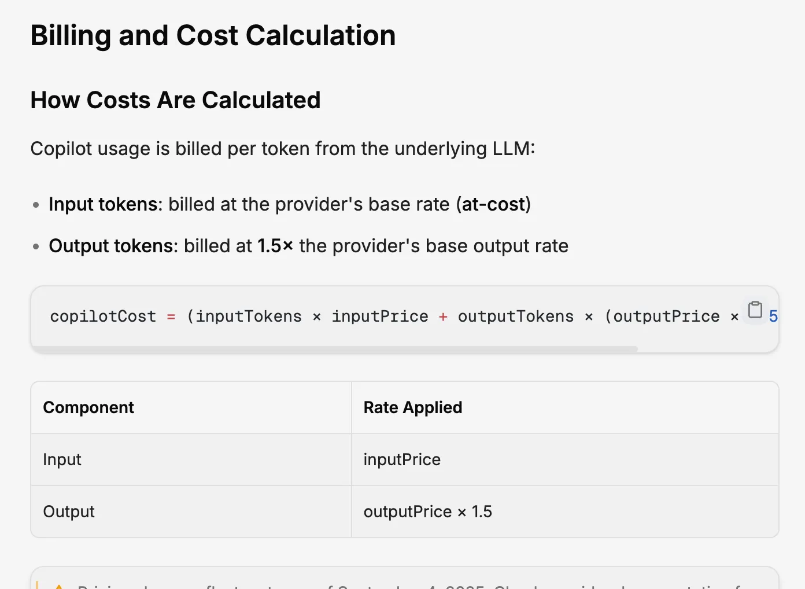

Copilot pricing is set higher than using the base LLM directly. This appears to be sim’s core business model.

---

## Wrap-up

sim is a technically polished open-source no-code agent workflow tool.

Self-hosted support, RAG, MCP, and broad integrations are clear strengths.  
However, it’s disappointing that the core feature—Copilot—is tied to a commercial service.

If you plan to use Cloud-hosted or use sim’s Copilot key in a Self-hosted setup, it’s an attractive option. If not, it seems best to compare it alongside other alternatives.