## 요약

노코드·로우코드 워크플로우 자동화 시장은 n8n과 Make가 사실상 표준처럼 자리 잡고 있다.  
이런 흐름 속에서 자연어 입력만으로 LLM이 워크플로우를 생성해주는 오픈소스 프로젝트 sim이 등장했다.

[sim](https://www.sim.ai/)은 Cloud-hosted(Managed) 방식뿐 아니라 Self-hosted 환경도 공식 지원하며, Helm Chart와 docker-compose까지 제공한다.  
다만 핵심 기능인 Copilot(LLM 기반 워크플로우 생성)은 Self-hosted 환경에서도 유료 API Key가 필요하다는 구조적 한계를 가진다.

---

## TL;DR

- sim은 자연어 입력으로 워크플로우를 생성하는 오픈소스 노코드 에이전트 툴이다.  
- Cloud-hosted와 Self-hosted를 모두 지원하며 운영 편의성은 높은 편이다.  
- RAG(Knowledge), MCP, 다양한 앱 연동 기능을 제공한다.  
- 핵심 기능인 Copilot은 Self-hosted 환경에서도 유료 결제가 필요하다.  
- Copilot 없이 사용하면 sim의 장점이 크게 줄어든다.

---

<video autoplay loop muted playsinline style="max-width:100%">
  <source src="/img/sim/action1.mp4" type="video/mp4">
</video>

## sim은 무엇인가

요즘 노코드 에이전트 구축 툴 시장은 n8n과 Make가 지배하고 있다.  
sim은 이런 시장에서 자연어 기반 워크플로우 자동 생성을 전면에 내세운 오픈소스 프로젝트다.

사용자가 자연어로 요구사항을 입력하면, LLM이 이를 해석해 워크플로우를 구성해준다.  
이 방식은 아직 beta버전인 Google의 Opal을 떠올리게 한다.

sim은 오픈소스로 공개되어 있으며, 동시에 Managed 형태의 Cloud-hosted 서비스도 함께 제공한다.

---

## 요금 구조와 LLM 사용 방식

Cloud-hosted 기준으로 무료 플랜은 20달러 크레딧이 제공된다.

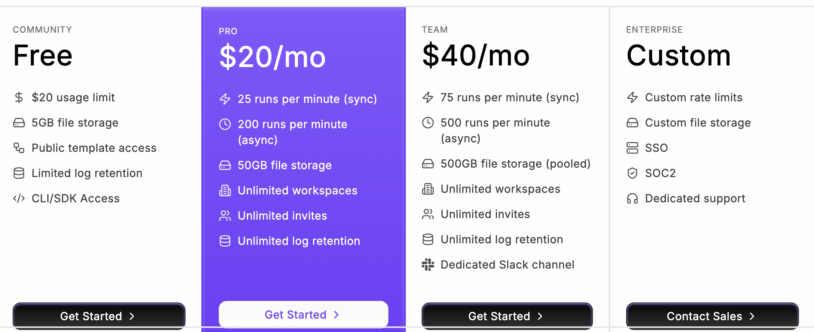

워크플로우에서 사용하는 LLM은 다음 두 가지 방식으로 사용할 수 있다. ( sim에서 제공하는 Copilot은 여기에 속하지 않는다. )

- 개인 LLM(openai, claude 등) API Key 사용
- sim에서 제공하는 플랫폼 키 사용

개인 API Key를 사용하지 않고 플랫폼 키를 사용할 경우, 비용은 약 2배로 증가한다. 개인 API Key를 삭제할 때, 경고 문구가 나오는거 보니, sim에서도 워크플로우는 개인 LLM API Key를 사용하기를 권장하는 것 처럼 느껴진다.

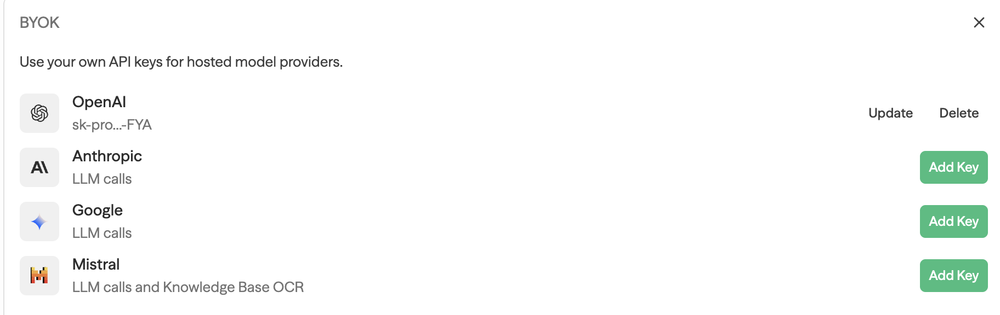
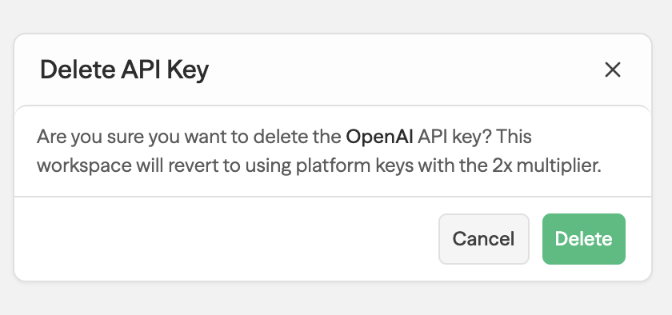

---

## Self-hosted 지원은 분명한 장점이다

sim은 Cloud-hosted뿐 아니라 Self-hosted 환경도 공식적으로 지원한다.

docker-compose와 Helm Chart를 모두 제공하기 때문에,  
Kubernetes 환경에서도 비교적 수월하게 운영할 수 있다.

운영 관점에서 보면 이는 sim의 큰 장점이다. 다만 이후에 설명하겠지만, Copilot API Key를 요구하는 구조로 인해 Self-hosted 환경에서도 비용과 제약이 발생하는 한계가 존재한다.

## 기본 동작 방식

sim의 기본 동작 흐름은 다음과 같다.

1. 사용할 LLM 모델을 설정한다.  
2. 자연어로 원하는 작업을 입력한다.  
3. LLM이 이를 해석해 워크플로우를 자동 생성한다.

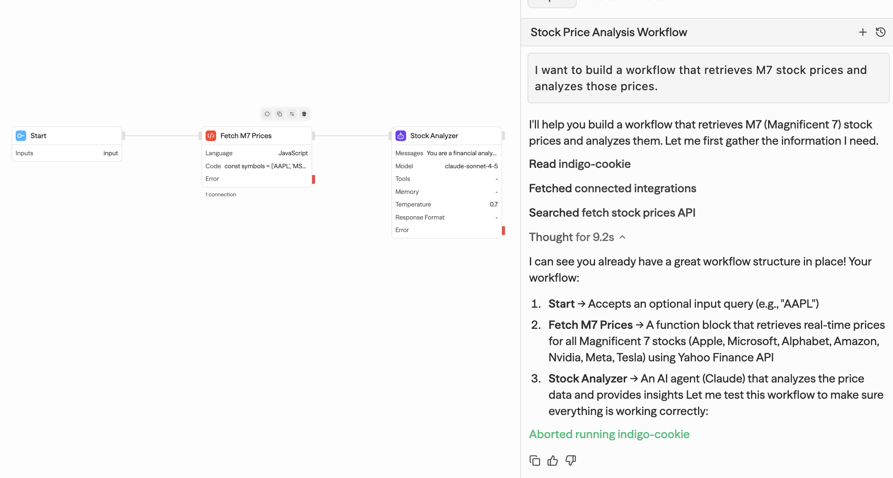

생성된 워크플로우는 단순 노드 연결이 아니라,  
필요에 따라 Code 실행 단계를 포함한다.

UI 상단의 RUN 버튼으로 즉시 실행할 수 있다.

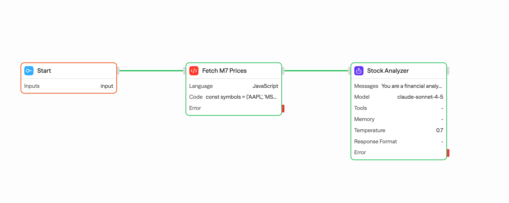
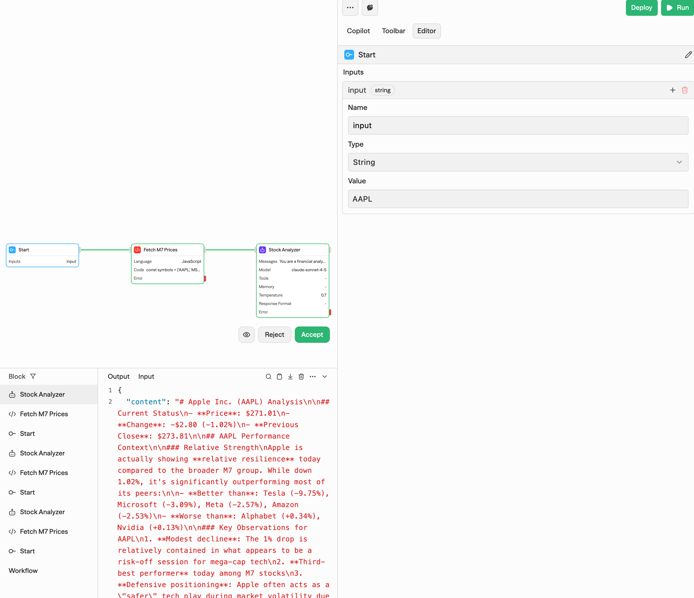

---

이렇게 간단하게 Agent를 포함한 워크플로우를 구축할 수 있다니 놀랍다.

## Deploy와 Trigger

워크플로우는 Deploy가 가능하며, 배포된 워크플로우는 API 호출로 실행할 수 있다.

지원되는 Trigger는 다음과 같다.

- Start (API 또는 수동 실행)
- Schedule
- Webhook
- RSS Feed

복수의 Trigger 설정도 가능하며, 실행 우선순위는 [공식 Docs - Trigger](https://docs.sim.ai/triggers)에 정리되어 있다.

---

## Toolbar와 Integration

sim은 LLM 기반 자동 생성뿐 아니라 수동 구성도 지원한다.

Toolbar에는 수많은 Tool과 Integration이 제공되며,  
이미 다양한 외부 서비스와 연동되어 있다. 아마, 구축하고자 하는 웬만한건 다 포함되어 있을 것 처럼 보인다.

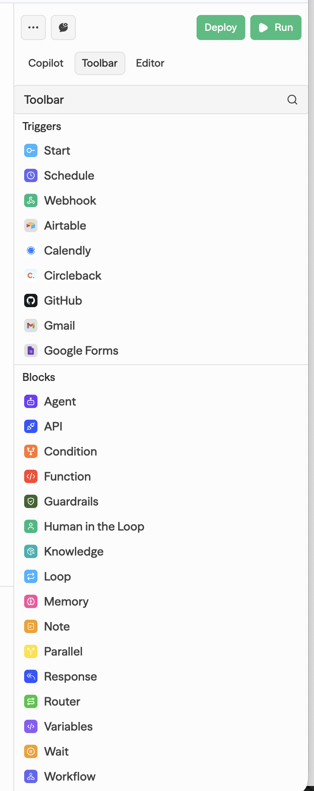

---

## Log 시스템

실행 로그 시스템도 잘 구성되어 있다. Run 성공/실패 여부, Trigger 종류, Error 상세 메시지까지 꽤나 로그 시스템이 잘 구축되어 있다.

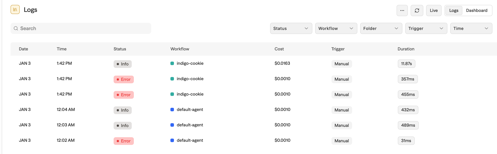
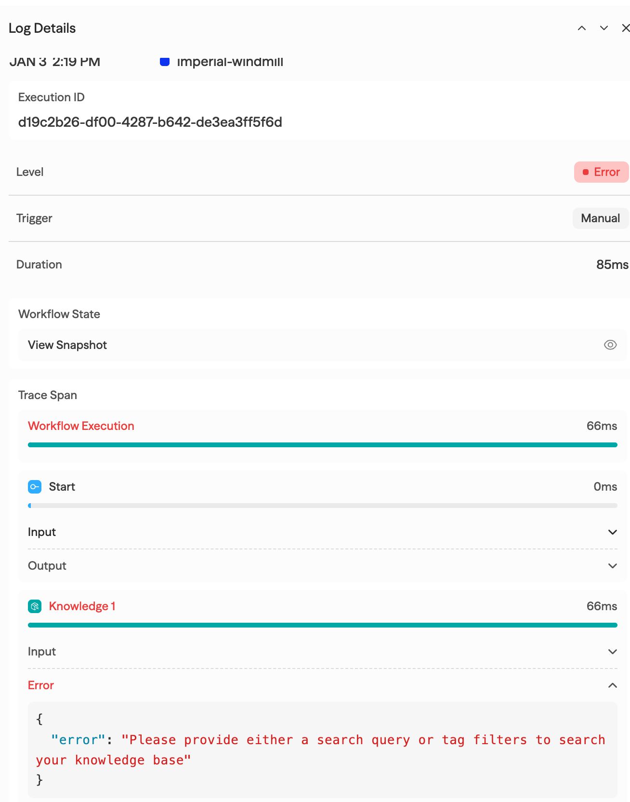

운영 환경에서도 충분히 활용 가능한 수준이다.

---

## Template

이미 구축된 워크플로우를 Template 형태로 가져올 수 있다.

처음부터 LLM으로 생성하지 않아도 되기 때문에 실용적이다.

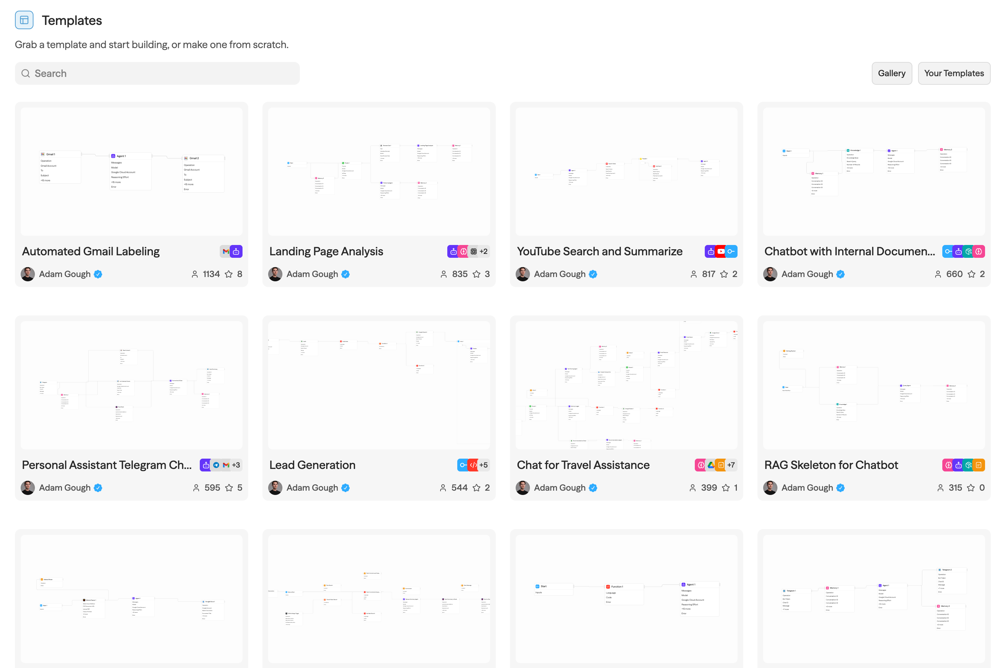

---

## Knowledge: RAG 구성

sim은 Knowledge 기능을 통해 Vector Store 기반 RAG 구성을 지원한다.

Transformer 논문을 업로드해 테스트했는데, Chunking과 Vector화가 빠르게 완료되었다.

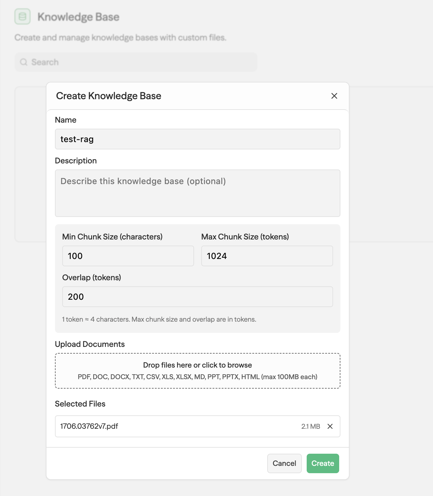
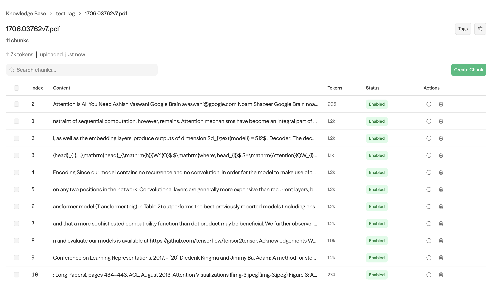

OCR도 지원해 이미지 문서 처리도 가능하다고 한다. RAG 시스템 구축을 이렇게 간단하게 할 수 있다는 점은 매력적으로 다가온다. 성능에 대해서는 측정해보지 못해서, 잘 모르겠다. 아마 문서에 따라 개인적으로 튜닝해야하지 않을까 싶다.

---

## Fix in Copilot

디버깅 경험은 꽤 인상적이다.

노코드 툴 특성상 수정 포인트를 찾기 어려운 상황에서도 Fix in Copilot 기능이 자동으로 문제를 해결해준다. 버튼을 누르고 LLM이 알아서 디버깅해서 워크플로우를 고친다. 이 부분은 참 매력적이라고 생각한다.

<video autoplay loop muted playsinline style="max-width:100%">
  <source src="/img/sim/action2.mp4" type="video/mp4">
</video>

---

## MCP 지원

기본적인 MCP는 이미 등록되어 있으며,  
필요한 경우 직접 MCP를 추가할 수 있다.

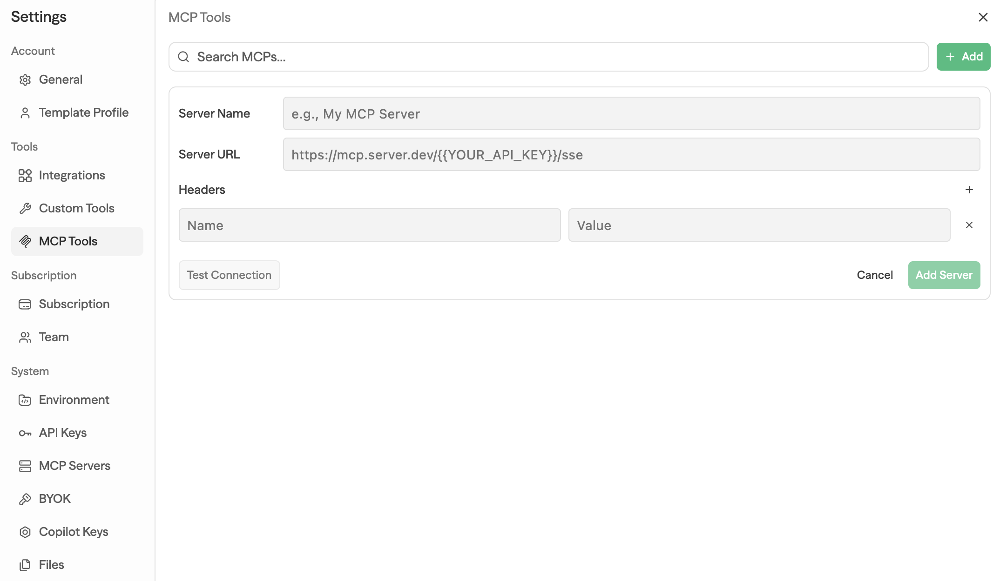

---

## 단점: Copilot API Key 의존 구조

아쉽지만, 치명적인 단점에 대해서도 언급하고 싶다. Cloud-hosted를 사용하는 사람에게는 상관없는 내용이다.

하지만, Self-hosted 환경에서 가장 치명적인 단점은 Copilot 기능 자체가 아니라, Copilot API Key를 반드시 요구하는 구조다.

sim에서 제공하는 Copilot을 사용하려면 Self-hosted 환경에서도  반드시 sim에서 발급한 API Key가 필요하다.

나같이, Self-hosted 오픈소스 + 개인 LLM API Key로 Agentic AI 시스템을 구축하겠다는 사람에게는, 다른 SaaS툴이 낀다는 부분이 마음에 들지 않는다.
이런 구조는 Self-hosted 환경에서 LLM 비용 통제와 데이터 주권을 중요하게 생각하는 엔지니어에게는 명확한 제약으로 작용한다.

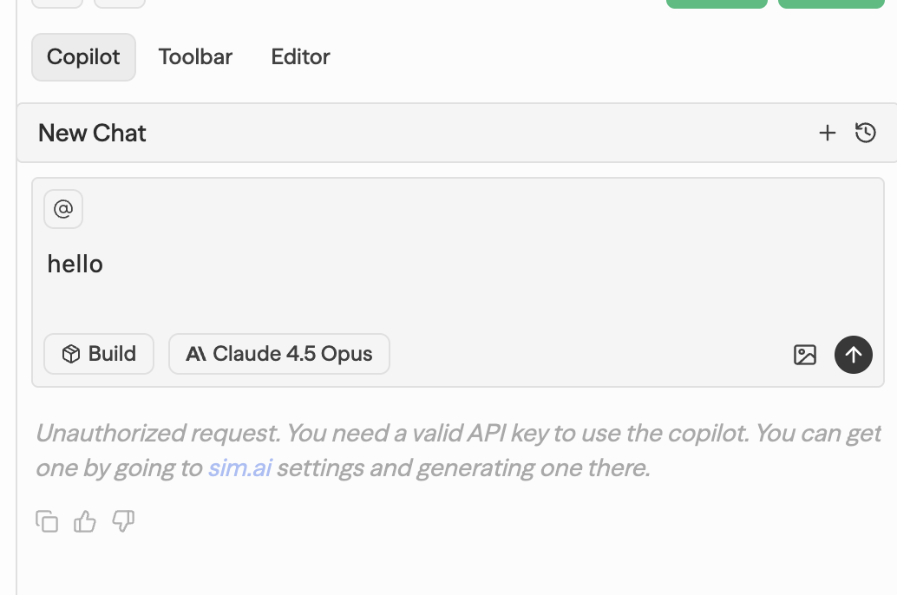
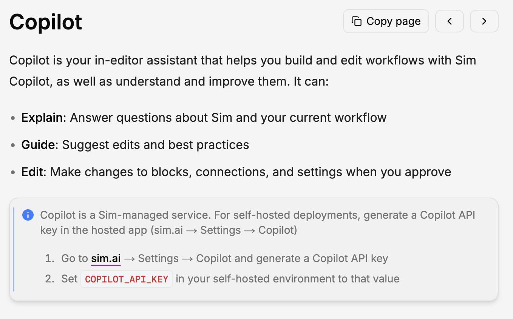
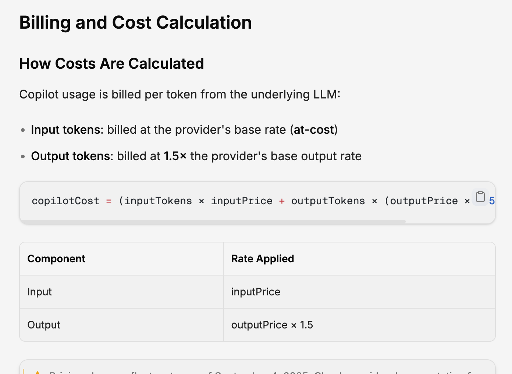

Copilot 비용은 기본 LLM을 직접 사용하는 것보다 비싸게 책정된다. 이는 sim의 핵심 비즈니스 모델로 보인다.

---

## 정리

sim은 기술적으로 완성도가 높은 오픈소스 노코드 에이전트 워크플로우 툴이다.

Self-hosted 지원, RAG, MCP, 다양한 Integration은 분명한 강점이다.  
그러나 핵심 기능인 Copilot이 상용 서비스에 종속되어 있다는 점은 아쉬운 부분이다.

Cloud hosted 혹은, Self-hosted에서 sim의 Copilot 키를 사용할 계획이라면 충분히 매력적인 선택지다. 그렇지 않다면 다른 대안과 함께 비교하는 것이 좋아 보인다.
