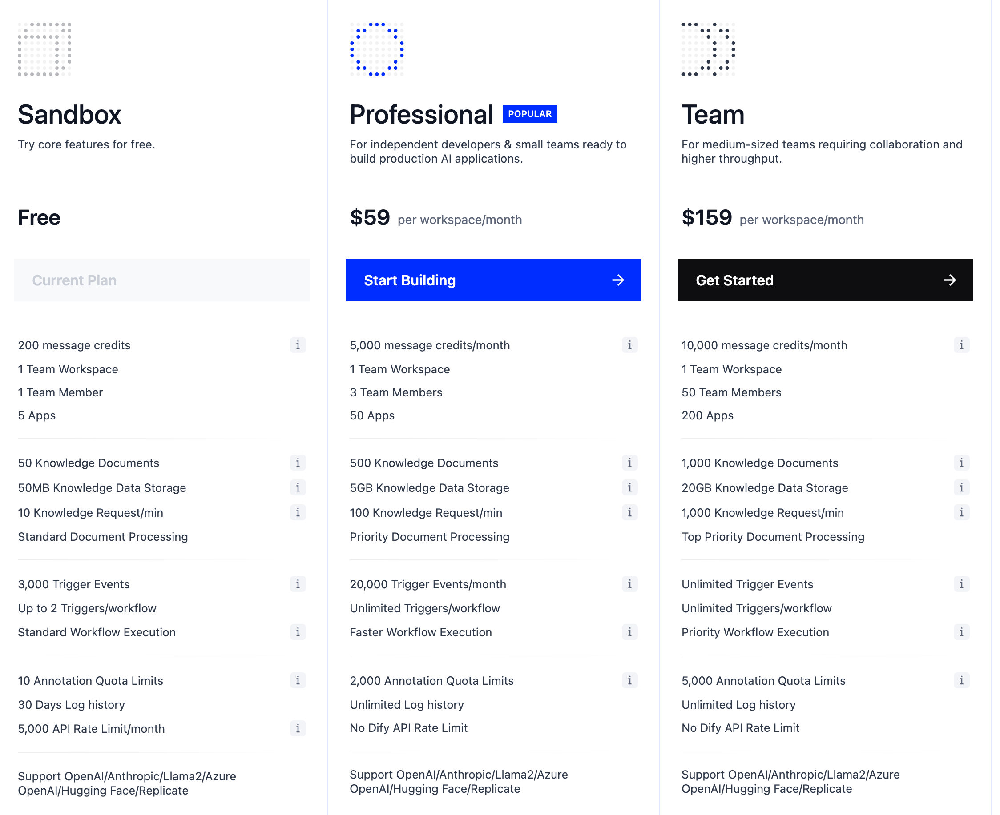

## TL;DR

> 3~4문장 핵심 결론. 이것만 읽어도 글의 가치를 파악할 수 있게.
> Featured Snippet 후보이므로 핵심 키워드 포함.

<!-- 도입부: 1~2문단. 이 글을 쓰게 된 배경, 독자가 공감할 문제 상황 -->

최근 Agent에 대한 관심이 많아지면서, 두 갈래로 나눠지는 것 같다.

흔히 말하는 바이브 코딩이란 걸 이용한 코드 기반의 Agent 시스템 구축과, 노코드 기반의 Agent 워크플로우 구축이다. 노코드 툴의 한계는 존재하지만 Agent를 코드 없이 구현한다는 부분에서 진입장벽은 확실히 낮다. 오늘 살펴볼 내용은, 후자인 노코드 툴 [dify](https://github.com/langgenius/dify)이다.

dify는 LangGenius 라는 회사에서 운영중인 오픈소스 플랫폼이다. 

The name Dify comes from **D**o **I**t **F**or **Y**ou. 

일단 dify는 다음과 같은 Key features 가 존재한다고 소개한다.

1. workflow: 시각적 캔버스에서 강력한 AI 워크플로를 구축하고 테스트할 수 있따.
2. Comprehensive model support: GPT, Mistral, Llama3 및 모든 OpenAI API 호환 모델을 포괄하는 수십 개의 추론 제공업체 및 자체 호스팅 솔루션 등 수백 개의 오픈소스 LLM과 원활하게 통합
3. Prompt IDE: 프롬프트 작성, 모델 성능 비교, TTS과 같은 추가 기능을 채팅 기반 앱에 추가하기 위한 직관적인 인터페이스
4. RAG Pipeline: PDF, PPT 및 기타 일반적인 문서 형식에서 텍스트 추출, 문서 수집부터 검색까지 포괄적인 RAG
5. Agent capabilities: LLM 함수 호출 또는 ReAct 기반으로 에이전트를 정의하고 에이전트에 대한 사전 구축된 도구나 사용자 정의 도구 추가
6. LLMOps: 시간 경과에 따른 애플리케이션 로그와 성능을 모니터링, 이를 통한 생산 데이터와 주석을 기반으로 프롬프트, 데이터세트, 모델을 지속적으로 개선
7. Backend-as-a-Service: Dify의 모든 제품에는 해당 API가 함께 제공되므로 Dify를 자신의 비지니스 로직에 쉽게 통합

위에 내용들이 실제로 얼마나 유용한지 테스트해보는게 본 글의 목적이다.

그 전에 Dify에 대해 조금 더 알아보면, 일단, Managed서비스로 Cloud환경과, Self-hosted 옵션이 존재한다.

가격 정책은 위의 사진과 같다. 가격은 사실 싼건지 비싼건지 잘 모르겠다. 

---

dify는 AgentOps를 대체할 수 있는가? 

https://www.linkedin.com/posts/petrituomola_dify-leading-agentic-workflow-builder-activity-7324263717674590208-drLz?utm_source=share&utm_medium=member_desktop&rcm=ACoAADTtEIgBaRhOOmWcUXTxiIwUPzSj9QrJ4ek

https://www.reddit.com/r/difyai/comments/1owtwj5/struggling_with_dify_should_i_stick_with_it_or/

https://skywork.ai/blog/dify-review-2025-workflows-agents-rag-ai-apps/?utm_source=chatgpt.com

## **⚠️** 

## **하지만 여전히 남아 있는 한계**

### **🛠 1)** 

### **실질적인 운영·거버넌스 제어는 제한적**

- Dify가 엔터프라이즈용 배포 옵션을 제공하는 건 사실이나,

  *진정한 의미의 운영 정책(토큰 예산, 완전한 RBAC, 실패 정책, SLAs, SLO 적용 등)* 은 문서상 명시적으로 깊게 제공되지는 않음.

  → 기능이 *존재하는 것처럼 보일 수 있으나*, **운영 정책 자동화 레벨은 여전히 낮음**. 

👉 📌 Enterprise 페이지가 “옵션이 있다”일 뿐, 실제 **정책 거버넌스/운영 자동화까지 완전하진 않음.

------

### **🧪 2)** 

### **운영 모니터링·Metrics가 완전하지 않음**

- observability/logging은 여전히 **사용자 입력/출력 중심 정도**이고,

  *agent/tool 단위 metric 집계, 롤백 트리거, 비용/지연 평가 지표가 실시간으로 정책화되는 수준*은 아님. 

👉 📌 모니터링은 “있다고 말할 수 있으나”,

정책 기반 운영 자동화로 보기엔 제한적.

------

### **📐 3)** 

### **이벤트 기반·Trigger 시스템 제한**

- 최신 릴리즈에서는 **워크플로우 트리거(스케줄/Webhook/SaaS Event)** 지원이 강화되긴 했지만,

  *챗플로우/Agent 자체는 트리거 지원이 아직 제한적*이라고 명시됨. 

👉 📌 이벤트 기반 자동화는 Workflow 중심이고, 전체 Agent 기능이 아니라는 한계.

------

### **📚 4)** 

### **엔터프라이즈 컴플라이언스/보안 스펙 불명확**

- Enterprise 문서에서 보안/접근 컨트롤을 이야기는 하지만 구체적인 **ISO/SOC2 같은 인증 레벨, 감사 로그 수준, 감사 추적 정책** 등은 상세하게 다루어지지 않음. 

👉 📌 보안·규제 준수 요구가 높은 산업에서는 별도 평가가 필요.
